# 🚀 **Vibe Sliding**のススメ

<AnimatedLogo text="Slidev" subtitle="次世代プレゼンテーションツール" />

<div class="pt-12">
  <span @click="$slidev.nav.next" class="px-2 py-1 rounded cursor-pointer" hover="bg-white bg-opacity-10">
    開発者のための新しいプレゼンテーション体験 <carbon:arrow-right class="inline"/>
  </span>
</div>

<div class="abs-br m-6 flex gap-2">
  <button @click="$slidev.nav.openInEditor()" title="Open in Editor" class="text-xl slidev-icon-btn opacity-50 !border-none !hover:text-white">
    <carbon:edit />
  </button>
  <a href="https://github.com/slidevjs/slidev" target="_blank" alt="GitHub" title="Open in GitHub"
    class="text-xl slidev-icon-btn opacity-50 !border-none !hover:text-white">
    <carbon-logo-github />
  </a>
</div>

<!--
発表者ノート：
今日は開発者向けの新しいプレゼンテーションツール、Slidevについてご紹介します。
Markdownで書けて、Vueコンポーネントが使える、まさに開発者のためのツールです。
-->

---
transition: fade-out
layout: center
---

# なぜ今、**Slidev**なのか？ 🤔

<v-clicks>

<div class="grid grid-cols-2 gap-8 pt-8">

<div class="border-2 border-green-500 rounded-lg p-6 transform hover:scale-105 transition-all">
  <h3 class="text-green-500 mb-4">✅ メリット</h3>
  <ul>
    <li>📝 Markdownで書ける</li>
    <li>🎨 CSS/UnoCSS完全対応</li>
    <li>⚡ HMRで即時プレビュー</li>
    <li>🔧 Vue 3コンポーネント対応</li>
    <li>📤 PDF/PPTX出力可能</li>
  </ul>
</div>

<div class="border-2 border-red-500 rounded-lg p-6 transform hover:scale-105 transition-all">
  <h3 class="text-red-500 mb-4">❌ 従来のツール</h3>
  <ul>
    <li>🖱️ GUIベースで面倒</li>
    <li>🚫 バージョン管理が困難</li>
    <li>💸 有料ツールが多い</li>
    <li>🔒 カスタマイズ性が低い</li>
    <li>📊 コード埋め込みが大変</li>
  </ul>
</div>

</div>

</v-clicks>

<!--
従来のプレゼンツールと比較して、Slidevには多くのメリットがあります。
特に開発者にとって、Markdownで書けることとGit管理できることは大きな利点です。
-->

---
transition: slide-up
layout: two-cols
layoutClass: gap-16
---

# 📚 **Slidev**とは？

開発者のためのプレゼンテーションメーカー

<v-clicks>

- 🎯 **Markdown中心**
  - YAML frontmatterで設定
  - MDC構文サポート
  
- ⚡ **Vite駆動**
  - 高速なHMR
  - 即座にプレビュー更新

- 🎨 **高度なテーマシステム**
  - UnoCSS/Tailwind対応
  - カスタムテーマ作成可能

</v-clicks>

::right::

<div class="flex items-center h-full">
  <div class="relative">
    <div class="absolute -inset-1 bg-gradient-to-r from-purple-600 to-pink-600 rounded-lg blur opacity-75 animate-pulse"></div>
    <div class="relative bg-black rounded-lg p-8">

```md
---
theme: seriph
---

# スライドタイトル

- 箇条書き
- **太字**や*斜体*
- `コード`も簡単

$$
E = mc^2
$$
```

  </div>
  </div>
</div>

<!--
Slidevは、Viteをベースにした高速な開発環境を提供します。
Markdownで書いたそばから、ブラウザでプレビューが更新されます。
-->

---
transition: view-transition
layout: center
class: text-center
---

# 🎨 Slidevの機能紹介

<div class="grid grid-cols-3 gap-6 pt-10">

<v-click>
<FeatureCard 
  title="シンタックスハイライト"
  description="Shikiによる美しいコード表示"
  color="blue"
>
  <template #icon>
    <carbon:code />
  </template>
</FeatureCard>
</v-click>

<v-click>
<FeatureCard 
  title="ドローイング機能"
  description="プレゼン中に描画可能"
  color="green"
>
  <template #icon>
    <carbon:draw />
  </template>
</FeatureCard>
</v-click>

<v-click>
<FeatureCard 
  title="インタラクティブ"
  description="Vue 3コンポーネント統合"
  color="orange"
>
  <template #icon>
    <carbon:chart-line />
  </template>
</FeatureCard>
</v-click>

</div>

<v-click>
<div class="mt-10">
  <span class="text-2xl animate-bounce inline-block">⬇️</span>
  <p class="text-gray-400">もっと詳しく見てみましょう</p>
</div>
</v-click>

<!--
Slidevの主要な3つの機能を紹介します。
それぞれの機能が開発者の生産性を大きく向上させます。
-->

---
layout: iframe-right
url: https://sli.dev
transition: slide-left
---

# 🖥️ コードハイライト機能

Shikiによる美しいシンタックスハイライト

```ts {all|2|3-5|7-9|all} twoslash
// TypeScriptの型定義例
interface User {
  id: number
  name: string
  email: string
}

function greetUser(user: User): string {
  return `Hello, ${user.name}!`
}

// 使用例
const user: User = {
  id: 1,
  name: "Alice",
  email: "alice@example.com"
}

console.log(greetUser(user))
```

<v-click>

📝 **特徴**
- 行ハイライト
- 段階的表示
- 言語自動検出
- テーマカスタマイズ

</v-click>

<!--
Shikiを使った高度なコードハイライト機能。
行番号表示、段階的なハイライト、多言語対応など。
-->

---
transition: fade
layout: center
---

# 📊 インタラクティブコンポーネント

<div class="flex flex-col justify-center items-center gap-8">
  <Counter :count="10" />
  
  <TypeWriter 
    text="Vueコンポーネントを直接埋め込み可能！" 
    :speed="80"
    :delay="500"
    :loop="true"
  />
</div>

<div class="mt-12 space-y-4">
  <ProgressBar label="開発効率" :percentage="95" color="green" />
  <ProgressBar label="カスタマイズ性" :percentage="100" color="purple" />
  <ProgressBar label="学習コスト" :percentage="30" color="blue" />
</div>

<!--
Vue 3コンポーネントを直接スライドに埋め込めます。
インタラクティブなデモやダイナミックなコンテンツの表示が可能です。
-->

---
layout: two-cols
transition: slide-up
---

# 🔧 数式とダイアグラム

KaTeXとMermaidのサポート

<v-clicks>

## 数式表現

$$
\begin{aligned}
\nabla \times \vec{\mathbf{B}} -\, \frac1c\, \frac{\partial\vec{\mathbf{E}}}{\partial t} &= \frac{4\pi}{c}\vec{\mathbf{j}} \\
\nabla \cdot \vec{\mathbf{E}} &= 4 \pi \rho \\
\nabla \times \vec{\mathbf{E}}\, +\, \frac1c\, \frac{\partial\vec{\mathbf{B}}}{\partial t} &= \vec{\mathbf{0}} \\
\nabla \cdot \vec{\mathbf{B}} &= 0
\end{aligned}
$$

</v-clicks>

::right::

<v-clicks>

## フローチャート

```mermaid
graph TD
    A[Markdown] -->|変換| B[HTML]
    B --> C{ブラウザ}
    C -->|表示| D[スライド]
    C -->|エクスポート| E[PDF/PPTX]
    
    style A fill:#f9f,stroke:#333,stroke-width:4px
    style D fill:#bbf,stroke:#333,stroke-width:2px
    style E fill:#bfb,stroke:#333,stroke-width:2px
```



</v-clicks>

<!--
数式やダイアグラムも簡単に埋め込めます。
技術プレゼンテーションに必要な要素が全て揃っています。
-->

---
transition: view-transition
layout: center
class: text-center
---

# 🚀 デプロイと共有

<div class="grid grid-cols-2 gap-8 mt-10">

<v-click>
<div class="relative group">
  <div class="absolute -inset-0.5 bg-gradient-to-r from-pink-600 to-purple-600 rounded-lg blur opacity-75 group-hover:opacity-100 transition duration-1000 group-hover:duration-200 animate-tilt"></div>
  <div class="relative bg-black rounded-lg p-8">
    <carbon:cloud class="text-5xl mb-4 text-purple-400"/>
    <h3 class="text-2xl font-bold mb-4">Vercel</h3>
    <p class="text-gray-300">ワンクリックデプロイ</p>
    <code class="text-sm text-green-400">vercel deploy</code>
  </div>
</div>
</v-click>

<v-click>
<div class="relative group">
  <div class="absolute -inset-0.5 bg-gradient-to-r from-green-600 to-blue-600 rounded-lg blur opacity-75 group-hover:opacity-100 transition duration-1000 group-hover:duration-200 animate-tilt"></div>
  <div class="relative bg-black rounded-lg p-8">
    <carbon:logo-github class="text-5xl mb-4 text-blue-400"/>
    <h3 class="text-2xl font-bold mb-4">GitHub Pages</h3>
    <p class="text-gray-300">CI/CDで自動公開</p>
    <code class="text-sm text-green-400">gh-pages</code>
  </div>
</div>
</v-click>

</div>

<v-click>
<div class="mt-10">

### 📤 エクスポート形式

<div class="flex justify-center gap-4 mt-4">
  <span class="px-4 py-2 bg-red-500 rounded-lg">PDF</span>
  <span class="px-4 py-2 bg-blue-500 rounded-lg">PPTX</span>
  <span class="px-4 py-2 bg-green-500 rounded-lg">PNG</span>
  <span class="px-4 py-2 bg-purple-500 rounded-lg">SPA</span>
</div>

</div>
</v-click>

<!--
作成したスライドは様々な形式でエクスポート可能。
VercelやGitHub Pagesなどにも簡単にデプロイできます。
-->

---
layout: image-right
image: https://source.unsplash.com/collection/94734566/1920x1080
transition: slide-left
---

# 📝 実際の使用例

<v-clicks>

## 1. インストール

```bash
npm init slidev@latest
```

## 2. 開発開始

```bash
npm run dev
```

## 3. スライド作成

```markdown
---
theme: default
---

# タイトル

内容をMarkdownで記述
```

## 4. 公開

```bash
npm run build
vercel deploy
```

</v-clicks>

<!--
実際の使用フローはとてもシンプル。
数分でプレゼンテーションの作成を開始できます。
-->

---
transition: fade-out
layout: center
class: text-center
---

# 🎯 活用シーン

<div class="grid grid-cols-2 gap-6 mt-10">

<v-click>
<div class="text-left p-6 bg-gradient-to-br from-blue-900/50 to-purple-900/50 rounded-xl border border-purple-500/50">
  <h3 class="text-2xl font-bold mb-4 text-blue-400">技術プレゼン</h3>
  <ul class="space-y-2">
    <li>✅ 勉強会・LT</li>
    <li>✅ 技術カンファレンス</li>
    <li>✅ 社内共有会</li>
    <li>✅ ハンズオン資料</li>
  </ul>
</div>
</v-click>

<v-click>
<div class="text-left p-6 bg-gradient-to-br from-green-900/50 to-teal-900/50 rounded-xl border border-green-500/50">
  <h3 class="text-2xl font-bold mb-4 text-green-400">教育・研修</h3>
  <ul class="space-y-2">
    <li>✅ プログラミング講座</li>
    <li>✅ ワークショップ</li>
    <li>✅ オンボーディング</li>
    <li>✅ ドキュメント作成</li>
  </ul>
</div>
</v-click>

</div>

<v-click>
<div class="mt-10 p-6 bg-gradient-to-r from-orange-900/50 to-red-900/50 rounded-xl border border-orange-500/50">
  <h3 class="text-xl font-bold text-orange-400">💡 特に効果的な場面</h3>
  <p class="text-gray-300 mt-2">コードを多用する技術系プレゼンテーション</p>
</div>
</v-click>

<!--
Slidevは特に技術系のプレゼンテーションで威力を発揮します。
コードのライブデモや、インタラクティブな説明が必要な場面で最適です。
-->

---
transition: view-transition
layout: fact
---

# 🤖 AIとの相性

<AnimatedLogo text="Claude Code" subtitle="AI駆動の開発体験" />

<div class="text-2xl mt-8 text-gray-300">
  このスライドも<span class="text-purple-400">AI</span>が作成しました
</div>

<v-click>
<div class="mt-10">
  <TypeWriter 
    text="Markdownベースだから、AIとの協働が簡単！" 
    :speed="60"
    :delay="300"
  />
</div>
</v-click>

<v-click>
<div class="mt-8 grid grid-cols-2 gap-4 max-w-2xl mx-auto">
  <ProgressBar label="コード生成精度" :percentage="98" color="purple" />
  <ProgressBar label="開発スピード" :percentage="300" color="pink" />
</div>
</v-click>

<!--
実は、このスライド自体もClaude Codeによって作成されました。
MarkdownベースのSlidevは、AIとの相性が抜群です。
-->

---
layout: center
transition: slide-up
class: text-center
---

# 🎉 まとめ

<div class="text-4xl font-bold mt-10 mb-10">
  <span class="bg-gradient-to-r from-green-400 to-blue-600 bg-clip-text text-transparent">
    Slidevで始める新しいプレゼンテーション体験
  </span>
</div>

<v-clicks>

<div class="grid grid-cols-3 gap-4 mt-8">
  <div class="p-4 bg-blue-900/30 rounded-lg">
    <carbon:code class="text-3xl mb-2"/>
    <p>開発者フレンドリー</p>
  </div>
  <div class="p-4 bg-green-900/30 rounded-lg">
    <carbon:rocket class="text-3xl mb-2"/>
    <p>高速・効率的</p>
  </div>
  <div class="p-4 bg-purple-900/30 rounded-lg">
    <carbon:share class="text-3xl mb-2"/>
    <p>簡単共有</p>
  </div>
</div>

<div class="mt-10 text-xl">
  今すぐ始めよう！ 👉 <a href="https://sli.dev" class="text-blue-400 hover:text-blue-300">sli.dev</a>
</div>

</v-clicks>

<!--
Slidevは開発者のためのプレゼンテーションツールです。
ぜひ一度試してみてください！
-->

---
layout: end
class: text-center
---

# ご清聴ありがとうございました！ 🙏

<div class="mt-8 text-xl text-gray-400">
  Questions?
</div>

<div class="mt-10">
  <a href="https://github.com/s-uchihori/vibe-sliding" target="_blank" class="inline-flex items-center gap-2 px-6 py-3 bg-gradient-to-r from-purple-500 to-pink-500 rounded-lg hover:from-purple-600 hover:to-pink-600 transition-all">
    <carbon-logo-github class="text-2xl"/>
    <span>Star on GitHub</span>
  </a>
</div>

<div class="absolute bottom-10 left-10 text-sm text-gray-500">
  Made with ❤️ using Slidev + Claude Code
</div>

<!--
ご質問があればお気軽にどうぞ。
SlidevのGitHubリポジトリもぜひチェックしてみてください！
-->